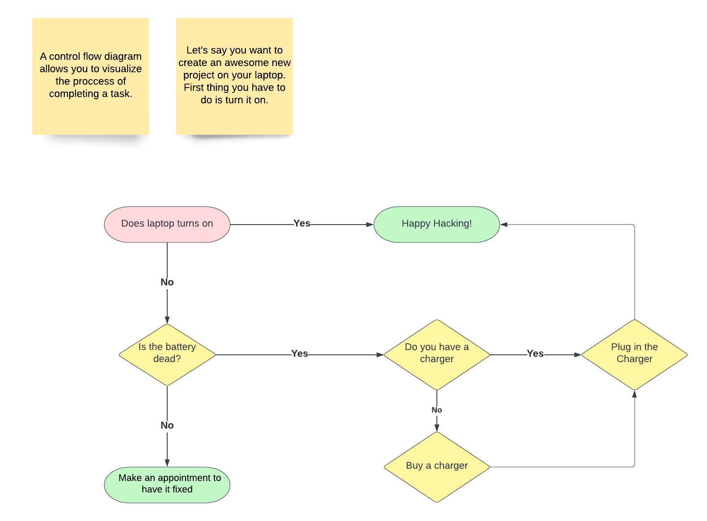

# Chegg Subject Matter Expert Assessment Submission

* Author: Roger Campbell II
* Contact:
  * Roger@gemstack.io
  * [LinkedIn](https://www.linkedin.com/in/mrrogercampbell/)
  * [GitHub](https://github.com/mrrogercampbell)

You can also view this repo as a [PDF](https://drive.google.com/file/d/1MaBLF42tOQZHHQLLvY33aVAkDmwcLCKV/view?usp=sharing).

---

## Table of Contents
- [Chegg Subject Matter Expert Assessment Submission](#chegg-subject-matter-expert-assessment-submission)
  - [Table of Contents](#table-of-contents)
  - [Part 1: New Writing](#part-1-new-writing)
  - [Part 2: Visual Asset Creation](#part-2-visual-asset-creation)
  - [Part 3: Previous Work](#part-3-previous-work)
    - [APIs](#apis)
    - [C Sharp](#c-sharp)
    - [JavaScript](#javascript)
      - [React](#react)
    - [Misc.](#misc)

## Part 1: New Writing
For this part of the assessment, I developed a script that meets the criteria for **Option 1**:
* **Audience**: Adults learning Software Engineering for professional development.
* **Learning objective**: By the end of this lesson, students will be able to explain what an array is.  
* **Scope of video script**: This video script would briefly introduce Arrays. It would include examples to help the student understand the concept. 

**Submission**: [What is an Array?](https://github.com/mrrogercampbell/what-is-an-array) repo

## Part 2: Visual Asset Creation
I utilized [Lucidchart](http://www.lucidchart.com) to create an annotated diagram that illustrates control flow.

I have also added a **PDF version**: [Control Flow Diagram](./pdfs/control-flow-diagram.pdf)

## Part 3: Previous Work
Below you will find a list of various courses, lesson plans, and other writing I have done in the past.

### APIs
* [Intro to GraphQL & Gatsby](https://github.com/mrrogercampbell/graphql-gastby-lesson)
  * **Target Learner**: Adult learner.
  * **Description**: A course that I developed for a cohort that expressed interest in learning GraphQL.
* [Graphql-curriculum](https://github.com/mrrogercampbell/graphql-curriculum)
  * **Target Learner**: Adult learner.
  * **Description**: An outline of a course I plan on writing.

### C Sharp
* [Microsoft CodeCamp Lecture Notes](https://github.com/mrrogercampbell/microsoft-codecamp-lecture-notes):
  * **Target Learner**: transitioning TS/SCI cleared military personnel and veterans enrolled in an 18-week full-time virtual Code Camp.
  * **Description**: This repo houses the lecture notes I created to assist me as the Lead Instructor in facilitating LaunchCode in partnership with Microsoft; 2021 Transitioning Military Virtual Code Camp.
    * More details [here](https://www.launchcode.org/training/microsoft-codecamp-2021).

### JavaScript
* [Nested For Loops](https://github.com/mrrogercampbell/nested-loops-lesson)
  * **Target Learner**: Adult learner.
  * **Description**: A 5 min lesson I created for a client to demonstrate my ability to develop and execute a lecture rapidly.
* [Intro-to-js-lesson](https://github.com/mrrogercampbell/intro-to-js-lesson)
  * **Target Learner**: Adult learner enrolled in a full-time software engineering Bootcamp.
  * **Description**: I gave some of my students in a previous cohort a quick JavaScript live demo crash course lesson.
    * You will find notes within the script.js file.
* [js-array-lesson](https://github.com/mrrogercampbell/js-array-lesson)
  * **Target Learner**: Adult learner.
  * **Description**: A lesson developed for a client to demonstrate my ability to create a lecture and teach it.

#### React
* [Intro-to-react-lesson-plan](https://github.com/mrrogercampbell/intro-to-react-lesson-plan)
  * **Target Learner**: Adult learner.
  * **Description**: This was designed for a client to showcase my skills in developing a lesson plan.
* [Learning React: Props, State, and Hooks](https://github.com/mrrogercampbell/intro-to-react-lesson)
  * **Target Learner**: Adult learner.
  * **Description**: A intro lecture created for students to learn about React.
* [Learning React: Prompts](https://github.com/mrrogercampbell/intro-to-react-lesson/tree/main/Prompts)
  * **Target Learner**: Adult learner.
  * **Description**: I created a set of prompts to test students' knowledge of React after teaching the **Learning React: Props, State, and Hooks** lesson above.
  * The empty react project was started code provided to the students.
* [Learning React: Prompt Solutions](https://github.com/mrrogercampbell/lesson-1-prompts)
  * **Target Learner**: Adult learner.
  * **Description**: Solution code to the prompts provided in the above repo.

### Misc.
* [Technical Interview Workshop](https://github.com/mrrogercampbell/technical-interview-workshop)
  * **Target Learner**: An adult learner who has just completed a full-time software engineering Bootcamp.
  * **Description**: A workshop that I developed and taught a few times a year for a client.
* [Technical Interview Workshop Slide Deck](https://docs.google.com/presentation/d/1zsId1oIYn7-mflEBfqzl10e2xXtUODp9sdUlbhEOHWw/edit?usp=sharing) 
  * **Target Learner**: Adult learner.
  * **Description**: The accompanying slide deck for the repo listed above.